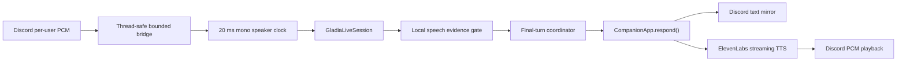

# Live Voice Chat — implementation plan

Status: Phases 1-4 implemented on `feature/voice-live-chat`; live text cognition
and streaming outbound speech accepted.

## Current checkpoint — 2026-08-16

Phases 1 and 2 are implemented and accepted in a private Discord channel.
The bot receives the starter's DAVE-protected Discord audio, repairs the pinned
receive fork's jitter-buffer loss amplification, streams paced mono PCM16 to
Gladia, posts final transcripts, and shuts down without saving live raw audio.

Phase 3 is implemented and live-tested. Stable finals are independently
corroborated against the exact local PCM timeline sent to Gladia, nearby finals
are assembled behind a quiet debounce, and accepted turns call the existing
`CompanionApp.respond()` path exactly once. Naomi's canonical response is posted
as Discord text and normal history/memory ownership remains inside the app.
Phone/Wi-Fi testing confirmed clean transport with zero clock/queue drops on
the final focused run. Deliberately pausing can still produce separate natural
turns; that is acceptable unless normal speech causes unwanted double replies.

Final live acceptance:

- Complete spoken sentence survived Discord → Gladia end to end.
- Thread-ring drops: `0`; event-loop queue drops: `0`; RTP clock drops: `1`.
- Late audio samples: `0` (previous failing run: `1,095,360`).
- Gladia completion: `normal`; last warning: none.
- Full unit suite: `158/158` passing.
- Naomi was stopped after the test; no bot process was intentionally left running.

Phase 4 is implemented and live-tested. The canonical Discord reply streams to
ElevenLabs Flash v2.5 as raw 48 kHz mono PCM16, is converted to exact 20 ms
Discord stereo frames through a bounded bridge, and plays through the existing
voice connection. Provider and playback failures are credential-redacted;
cancellation stops playback and wakes the Discord reader without writing audio
to disk.

Phase 4 live acceptance produced three accepted turns, three text replies, and
three matching spoken replies. Seven duplicate/noise-like finals were rejected.
The run had zero receive-thread drops, zero event-loop queue drops, zero late
samples, one isolated corrupt Discord frame that the existing guard survived,
and 305 clock-dropped packets during phone/Wi-Fi testing. Leaving the channel
triggered normal automatic shutdown. The complete automated suite passed
`183/183` after the public privacy-notice and TTS-cancellation regressions were
added.

Phase 5 is next. Do not reopen or replace the verified receive/transport
lifecycle unless a new deterministic regression proves it necessary.

## Outcome

The existing Discord bot joins a private voice channel, transcribes the session
starter through Gladia Live V2, sends accepted final turns through the existing
`CompanionApp.respond()` path, mirrors the response in channel text, and later
speaks that same response through the existing Discord voice connection.

The first production-shaped version is deliberately single-human and
half-duplex. Multi-speaker sessions, automatic barge-in, and indefinite room
presence are later phases.



## Ownership boundaries

- `discord_app/voice_sink.py` owns only the synchronous Discord PCM callback.
- `discord_app/voice_session.py` owns guild lifecycle, bounded audio queues,
  speaker identity, turn serialization, consent state, and shutdown.
- `adapters/gladia_live.py` owns only the Gladia Live V2 protocol.
- `CompanionApp.respond()` remains the single owner of persona, recall, safety,
  model invocation, conversation history, and memory effects.
- `adapters/elevenlabs_tts.py` owns only text-to-audio transport.
- `discord_app/voice_playback.py` owns Discord-compatible PCM framing and
  playback interruption.

Infrastructure transports audio and text. The companion continues to own
meaning.

## Phase 0 — documentation discovery (complete)

### Confirmed APIs

Discord and DAVE:

- Connect with `await channel.connect(cls=voice_recv.VoiceRecvClient,
  self_deaf=False)`.
- Start receive with synchronous `vc.listen(sink, after=...)`.
- Stop receive and playback independently with `vc.stop_listening()` and
  `vc.stop_playing()`. Do not use the extension's combined `vc.stop()` unless
  both should stop.
- A PCM sink implements `wants_opus() -> False`, `write(user, VoiceData)`, and
  `cleanup()`.
- Decoded input is signed PCM16, 48 kHz, stereo; a normal 20 ms frame is 3,840
  bytes.
- `AudioSink.write()` runs on the packet-router thread. Cross into asyncio only
  with `loop.call_soon_threadsafe(...)`.
- Outbound DAVE encryption is automatic in discord.py. Inbound DAVE decryption
  is supplied by the pinned receive fork. Application code must not perform a
  second DAVE pass.
- A non-Opus `discord.AudioSource.read()` returns exactly 3,840 bytes of PCM16
  48 kHz stereo per 20 ms, or `b""` at end-of-stream.

References:

- [discord.py voice API](https://discordpy.readthedocs.io/en/latest/api.html#voice-related)
- [discord-ext-voice-recv](https://github.com/imayhaveborkedit/discord-ext-voice-recv)
- [Inbound DAVE PR](https://github.com/imayhaveborkedit/discord-ext-voice-recv/pull/58)
- [Discord DAVE protocol](https://daveprotocol.com/)
- Existing receive flow: `disco_proxy_soul/discord_app/commands.py:357`
- Existing sink: `disco_proxy_soul/discord_app/voice_sink.py:10`
- Existing compatibility guard: `disco_proxy_soul/discord_app/voice_compat.py:14`

Gladia Live V2:

- Create a session with `POST https://api.gladia.io/v2/live` and the
  `x-gladia-key` header, then connect to the returned temporary WebSocket URL.
- Send raw PCM with WebSocket binary messages.
- End with `{"type":"stop_recording"}` and wait for `end_session`/normal close.
- Partial and final transcripts share `data.id`; only `is_final: true` is stable.
- Utterances include `start`, `end`, `confidence`, `channel`, `words`, `text`,
  and `language`.
- Enable transcript, speech, acknowledgment, error, and lifecycle messages.
- Voice-agent endpointing guidance is 0.05–0.1 seconds. Start at 0.1 seconds;
  aggregate stable finals separately when a human turn spans multiple
  utterances.
- Endpointing needs received silence. A live sender must maintain a 20 ms clock
  and transmit silence when Discord packets are absent.
- Free accounts currently allow one concurrent live session; paid default is
  30. A session has a published three-hour maximum.

References:

- [Live init API](https://docs.gladia.io/api-reference/v2/live/init)
- [Live WebSocket API](https://docs.gladia.io/api-reference/v2/live/websocket)
- [Endpointing](https://docs.gladia.io/chapters/live-stt/features/endpointing)
- [Recommended parameters](https://docs.gladia.io/chapters/live-stt/recommended-parameters)
- [Concurrency](https://docs.gladia.io/chapters/limits-and-specifications/concurrency)
- Existing replay client: `disco_proxy_soul/adapters/gladia_live.py:174`

ElevenLabs outbound TTS:

- With a complete companion response, prefer HTTP streaming:
  `POST /v1/text-to-speech/{voice_id}/stream`.
- Start with `model_id=eleven_flash_v2_5` and
  `output_format=pcm_48000`.
- The stream returns raw signed PCM16 little-endian bytes. HTTP chunks are not
  guaranteed to align to samples or Discord frames.
- Native 48 kHz PCM can avoid MP3, temporary files, FFmpeg, process startup,
  and resampling. Account support for `pcm_48000` must be capability-tested;
  official tier documentation is ambiguous.
- WebSocket TTS is deferred until the companion itself emits streamed text.

References:

- [Streaming speech API](https://elevenlabs.io/docs/api-reference/text-to-speech/stream)
- [Latency guidance](https://elevenlabs.io/docs/eleven-api/guides/how-to/best-practices/latency-optimization)
- [TTS models](https://elevenlabs.io/docs/overview/models)
- Donor cleanup/request ideas: `character-voice-bot/bot.py:155-185`

### Phase 0 anti-pattern guards

- Do not invent receive methods such as `start_recording()`, `recv()`, or
  `await vc.play(...)`; they do not exist in the installed APIs.
- Do not block, await, call Gladia, invoke cognition, or synthesize speech from
  `AudioSink.write()`.
- Do not log the Gladia WebSocket URL; its token is a credential.
- Do not feed partial transcripts into cognition, history, tools, or memory.
- Do not send duplicated Discord stereo as two Gladia channels.
- Do not start one Gladia session per packet or utterance.
- Do not copy the donor sidecar's second Discord bot, MP3 disk writes, or audio
  attachment delivery.
- Do not stage `character-voice-bot/` or any private configuration by accident.

## Phase 1 — extract a reusable Gladia live session

### Implement

Refactor `adapters/gladia_live.py` around a reusable `GladiaLiveSession` with:

- `connect()`, `send_pcm()`, event receive, `stop()`, and async context-manager
  lifecycle.
- Retained session ID for diagnostics and result recovery.
- Structured `TranscriptWord`, `TranscriptUpdate`, speech, lifecycle, and error
  events, copying the documented WebSocket schemas.
- Transcript identity, timestamps, confidence, language, channel, and words.
- Final deduplication by `(session_id, utterance_id)` and bounded/latest-only
  partial state.
- Acknowledgments enabled.
- Useful redacted HTTP validation errors.
- Explicit normal versus abnormal WebSocket completion.
- Live default endpointing of 0.1 seconds while leaving replay overrides
  available.

Keep `transcribe_wave_live()` as a thin real-time WAV driver using the same
session class. The known-good diagnostic WAV remains the integration fixture.

### Verify

- Parser tests cover complete partial/final, speech, lifecycle, acknowledgment,
  top-level error, and malformed messages.
- Duplicate finals are delivered once.
- Partial storage stays bounded.
- Keys and tokenized URLs never appear in errors or logs.
- Replay still produces the confirmed sentence once after mono downmix.

### Guards

- Do not assume every error is `{"type":"error"}`.
- Do not add undocumented reconnect offsets or resend semantics.
- Do not put cognition callbacks inside the WebSocket receive loop; publish
  structured events to a queue.

## Phase 2 — single-speaker live transcription

### Implement

Add `discord_app/voice_session.py` and a production PCM sink:

- `/voice-chat start`, `/voice-chat stop`, and `/voice-chat status` lifecycle.
- Session starter must already be in the voice channel.
- The first slice listens only to the starter's Discord user ID. Other humans
  are ignored until multi-speaker behavior is deliberately enabled.
- Public start notice says live audio is being sent to Gladia and final
  transcripts enter companion history. Live mode does not save raw WAV files.
- Install the existing corrupt-frame guard before connecting.
- Bridge the packet-router thread with `loop.call_soon_threadsafe()` into a
  bounded event-loop queue.
- Convert duplicated stereo PCM16 to mono.
- Maintain a paced 20 ms speaker clock using RTP timestamps, short pre-roll,
  and inserted silence so Gladia endpointing sees real pauses.
- Start Gladia during command startup, not on the first spoken packet, so the
  first words are not lost to HTTP/WebSocket setup.
- Make receive shutdown awaitable through the extension's `after` callback,
  then stop Gladia and disconnect cleanly.
- Report queue drops and abnormal transport endings visibly.

Add canonical config fields to `RuntimeConfig` and `.env.example`, including:

- `GLADIA_API_KEY`
- `VOICE_ENABLED`
- `VOICE_ENDPOINTING_SECONDS`
- `VOICE_QUEUE_SECONDS`
- `VOICE_MIN_SPEECH_MS`

### References to copy

- Join/listen/stop structure: `discord_app/commands.py:373-436`.
- Sink validation: `discord_app/voice_sink.py:10-35`.
- RTP gap behavior: `discord_app/voice_capture.py:74-127`.
- Bounded handoff: installed `AudioSink.write()` contract plus
  `loop.call_soon_threadsafe()`.

### Verify

- Threaded sink tests prove no asyncio/network work happens on the receive
  thread.
- Queue tests prove bounded capacity and visible drop counts.
- RTP-gap tests prove silence is sent on the correct 20 ms clock.
- Start/stop tests cover wrong channel, duplicate start, Gladia failure,
  receiver failure, and idempotent cleanup.
- Private live test prints partial captions and stable finals without invoking
  cognition yet.

### Guards

- No unbounded queues.
- No lazy first-frame connection without pre-roll.
- No raw audio persistence in live mode.
- No more than one Gladia session in the first slice.
- Never call `VoiceRecvClient.stop()` when only listening should stop.

## Phase 3 — artifact gate, human-turn assembly, and cognition

### Implement

- Maintain a rolling per-speaker activity timeline aligned to the exact audio
  clock sent to Gladia.
- Correlate Gladia utterance `start`/`end` with local energy evidence.
- Accept only finals with sufficient independent local voiced duration and
  usable confidence. Do not reject solely because text is one word.
- Aggregate adjacent accepted finals into one human turn with a short,
  configurable quiet debounce. This keeps low Gladia endpointing latency while
  avoiding one companion reply per sentence.
- Serialize turns with one `asyncio.Lock` per conversation key.
- Invoke cognition exactly once:

  ```python
  reply = await app.respond(
      conversation_key,
      f"[{speaker_name}]: {final_turn}",
      interaction_mode="voice",
  )
  ```

- Add an optional voice interaction context to the system-prompt path so spoken
  replies are natural and concise without storing hidden control text in
  conversation history.
- Mirror the one companion reply into the voice channel's text chat. That text
  remains the canonical reaction/audit surface and is the same text later sent
  to TTS.

Default the conversation key to the voice channel ID. A future explicit mapping
may merge a voice room with another text channel, but the first version must not
silently mix histories.

### References to copy

- Cognition entry point: `CompanionApp.respond()` in `app.py:121-184`.
- Existing speaker label: `discord_app/bot.py:69`.
- Existing lock pattern: `CompanionApp.compress()` in `app.py:192-197`.
- Prompt assembly: `prompt.build_system_prompt()` in `prompt.py:10-61`.

### Verify

- A low-energy tail mapped to a false one-word final is rejected.
- A real high-confidence one-word reply such as “yes” is accepted.
- Partial “trash” followed by final “Travis” creates only the Travis turn.
- Two quick finals aggregate into one cognition call.
- Concurrent finals cannot race history writes.
- The transcript and companion response appear once in the expected history.

### Guards

- Gladia's own `speech_start`/`speech_end` is not independent artifact evidence.
- Do not store partials or hidden voice-mode control instructions as human
  history.
- Do not call `app.respond()` concurrently for the same conversation.
- Do not generate separate text and spoken answers.

## Phase 4 — streaming outbound speech

### Implement

Add `adapters/elevenlabs_tts.py`:

- HTTP streaming request using `eleven_flash_v2_5` and `pcm_48000`.
- Server-side `xi-api-key` authentication with redacted errors.
- Configurable voice ID, stability, similarity, speed, and low-latency defaults
  (`style=0`, speaker boost initially off).
- A startup/first-request capability probe for 48 kHz PCM and a clear failure
  or explicit fallback if the account rejects the format.

Add `discord_app/voice_playback.py`:

- Preserve incomplete samples across arbitrary HTTP chunks.
- Verify the provider channel layout during the first live probe.
- Convert mono PCM16 to Discord stereo PCM16.
- Emit exact 3,840-byte/20 ms frames from a bounded buffer.
- Pad only the final incomplete frame.
- Play through the existing `VoiceRecvClient` with
  `application="voip"`, `signal_type="voice"`.
- Make playback completion awaitable through its thread callback.

Port only the donor's speakable-text cleanup ideas: remove URLs, Discord
mention/emoji markup, and markdown that should not be spoken. Review slang
expansion carefully instead of copying the entire hard-coded table.

Add `Speak` to documented Discord permissions and add:

- `TTS_PROVIDER=elevenlabs`
- `ELEVENLABS_API_KEY`
- `ELEVENLABS_VOICE_ID`
- voice tuning settings

### Verify

- Mocked HTTP tests cover request shape, arbitrary and odd-byte chunk splits,
  redaction, account-format rejection, and cancellation.
- PCM tests cover mono-to-stereo conversion, exact frame sizing, final padding,
  and bounded buffering.
- A live capability probe reports actual format, time-to-first-byte, and
  time-to-first-playable-frame.
- Naomi speaks the exact text already mirrored in Discord while listening
  remains active.

### Guards

- Do not wait for the whole generated file before playback.
- Do not assume HTTP chunks equal audio frames.
- Do not write MP3s or WAVs to disk.
- Do not introduce FFmpeg unless the native PCM capability probe proves a
  fallback is required.
- Do not use ElevenLabs WebSocket TTS until cognition itself streams text.

## Phase 5 — interruption, resilience, and long-session behavior

### Implement

- Begin half-duplex: queue incoming accepted human turns while Naomi speaks.
- Add explicit barge-in only after measuring full-duplex echo and interruption
  behavior. Barge-in stops playback with `stop_playing()` without stopping
  receive.
- Reconnect Gladia to the same temporary URL after abnormal closure, bounded by
  a documented retry policy. Never invent byte replay guarantees.
- Rotate Gladia sessions safely before the three-hour limit.
- Preserve session IDs for result recovery without logging bearer URLs.
- Surface DAVE frame drops, audio queue drops, STT latency, model latency, TTS
  first-byte latency, and playback latency.
- Stop cleanly when the starter leaves, the bot is moved/disconnected, or the
  process shuts down.

### Verify

- Injected transport failures do not deadlock Discord receive.
- Playback cancellation does not stop listening.
- Stop during STT, cognition, TTS, and playback is idempotent.
- A dependency compatibility test continues to cover the pinned DAVE fork and
  corrupt-frame guard.

### Guards

- Do not automatically upgrade beyond the pinned discord.py/receive-fork pair.
- Do not resend unacknowledged Gladia bytes without an integration-tested rule.
- Do not use the extension's approximate speaking-stop event as the only turn
  boundary.

## Phase 6 — multi-speaker voice (deferred product decision)

Choose only after the single-human loop is stable and the Gladia account limit
is known:

- One live session per speaker: simplest identity and overlap handling, but
  consumes concurrency.
- One fixed multichannel Gladia session: up to eight mapped speakers, but
  requires a synchronized shared clock, channel assignment, silence filling,
  and per-channel billing.

Do not silently degrade to mixed audio or lose speaker identity. Consent,
participant joins/leaves, simultaneous turns, and cost must be explicit.

## Final verification

- Run the complete unit suite and syntax/import checks.
- Run `git diff --check` and inspect the exact staged scope; never use blind
  `git add -A` while donor/private directories are present.
- Confirm no secret, Gladia bearer URL, recording, generated audio, or private
  persona material is tracked.
- Re-run the known WAV through the refactored client.
- Run a private-room acceptance sequence:
  1. Start with public consent notice.
  2. Speak a multi-sentence turn and a valid one-word turn.
  3. Confirm partials never enter cognition.
  4. Confirm noise does not create a turn.
  5. Confirm one text reply and one matching spoken reply.
  6. Interrupt/stop and confirm all tasks, WebSockets, receive, and playback
     close.
- Verify every external field and method still matches the linked primary
  documentation and pinned installed packages.

## First executable slice

Implement Phases 1 and 2 first, stopping at live stable transcripts in the
private test channel. Do not connect cognition or TTS in that slice. Once live
turns and cleanup are boring, add Phase 3 so Naomi answers in text. Add speech
only after that path preserves the correct history exactly once.
