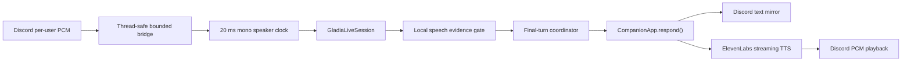

# Live Voice Chat — implementation plan

Status: Phases 1-4 implemented on `feature/voice-live-chat`; live text cognition
and streaming outbound speech accepted.

## Current checkpoint — 2026-08-16

Phases 1 and 2 are implemented and accepted in a private Discord channel.
The bot receives the starter's DAVE-protected Discord audio, repairs the pinned
receive fork's jitter-buffer loss amplification, streams paced mono PCM16 to
Gladia, posts final transcripts, and shuts down without saving live raw audio.

Phase 3 is implemented and live-tested. Stable finals are independently
corroborated against the exact local PCM timeline sent to Gladia, nearby finals
are assembled behind a quiet debounce, and accepted turns call the existing
`CompanionApp.respond()` path exactly once. Naomi's canonical response is posted
as Discord text and normal history/memory ownership remains inside the app.
Phone/Wi-Fi testing confirmed clean transport with zero clock/queue drops on
the final focused run. Deliberately pausing can still produce separate natural
turns; that is acceptable unless normal speech causes unwanted double replies.

Final live acceptance:

- Complete spoken sentence survived Discord → Gladia end to end.
- Thread-ring drops: `0`; event-loop queue drops: `0`; RTP clock drops: `1`.
- Late audio samples: `0` (previous failing run: `1,095,360`).
- Gladia completion: `normal`; last warning: none.
- Full unit suite: `158/158` passing.
- Naomi was stopped after the test; no bot process was intentionally left running.

Phase 4 is implemented and live-tested. The canonical Discord reply streams to
ElevenLabs Flash v2.5 as raw 48 kHz mono PCM16, is converted to exact 20 ms
Discord stereo frames through a bounded bridge, and plays through the existing
voice connection. Provider and playback failures are credential-redacted;
cancellation stops playback and wakes the Discord reader without writing audio
to disk.

Phase 4 live acceptance produced three accepted turns, three text replies, and
three matching spoken replies. Seven duplicate/noise-like finals were rejected.
The run had zero receive-thread drops, zero event-loop queue drops, zero late
samples, one isolated corrupt Discord frame that the existing guard survived,
and 305 clock-dropped packets during phone/Wi-Fi testing. Leaving the channel
triggered normal automatic shutdown. The complete automated suite passed
`183/183` after the public privacy-notice and TTS-cancellation regressions were
added.

Phase 5 is next. Do not reopen or replace the verified receive/transport
lifecycle unless a new deterministic regression proves it necessary.

## Outcome

The existing Discord bot joins a private voice channel, transcribes the session
starter through Gladia Live V2, sends accepted final turns through the existing
`CompanionApp.respond()` path, mirrors the response in channel text, and later
speaks that same response through the existing Discord voice connection.

The first production-shaped version is deliberately single-human and
half-duplex. Multi-speaker sessions, automatic barge-in, and indefinite room
presence are later phases.



## Ownership boundaries

- `discord_app/voice_sink.py` owns only the synchronous Discord PCM callback.
- `discord_app/voice_session.py` owns guild lifecycle, bounded audio queues,
  speaker identity, turn serialization, consent state, and shutdown.
- `adapters/gladia_live.py` owns only the Gladia Live V2 protocol.
- `CompanionApp.respond()` remains the single owner of persona, recall, safety,
  model invocation, conversation history, and memory effects.
- `adapters/elevenlabs_tts.py` owns only text-to-audio transport.
- `discord_app/voice_playback.py` owns Discord-compatible PCM framing and
  playback interruption.

Infrastructure transports audio and text. The companion continues to own
meaning.

## Phase 0 — documentation discovery (complete)

### Confirmed APIs

Discord and DAVE:

- Connect with `await channel.connect(cls=voice_recv.VoiceRecvClient,
  self_deaf=False)`.
- Start receive with synchronous `vc.listen(sink, after=...)`.
- Stop receive and playback independently with `vc.stop_listening()` and
  `vc.stop_playing()`. Do not use the extension's combined `vc.stop()` unless
  both should stop.
- A PCM sink implements `wants_opus() -> False`, `write(user, VoiceData)`, and
  `cleanup()`.
- Decoded input is signed PCM16, 48 kHz, stereo; a normal 20 ms frame is 3,840
  bytes.
- `AudioSink.write()` runs on the packet-router thread. Cross into asyncio only
  with `loop.call_soon_threadsafe(...)`.
- Outbound DAVE encryption is automatic in discord.py. Inbound DAVE decryption
  is supplied by the pinned receive fork. Application code must not perform a
  second DAVE pass.
- A non-Opus `discord.AudioSource.read()` returns exactly 3,840 bytes of PCM16
  48 kHz stereo per 20 ms, or `b""` at end-of-stream.

References:

- [discord.py voice API](https://discordpy.readthedocs.io/en/latest/api.html#voice-related)
- [discord-ext-voice-recv](https://github.com/imayhaveborkedit/discord-ext-voice-recv)
- [Inbound DAVE PR](https://github.com/imayhaveborkedit/discord-ext-voice-recv/pull/58)
- [Discord DAVE protocol](https://daveprotocol.com/)
- Existing receive flow: `disco_proxy_soul/discord_app/commands.py:357`
- Existing sink: `disco_proxy_soul/discord_app/voice_sink.py:10`
- Existing compatibility guard: `disco_proxy_soul/discord_app/voice_compat.py:14`

Gladia Live V2:

- Create a session with `POST https://api.gladia.io/v2/live` and the
  `x-gladia-key` header, then connect to the returned temporary WebSocket URL.
- Send raw PCM with WebSocket binary messages.
- End with `{"type":"stop_recording"}` and wait for `end_session`/normal close.
- Partial and final transcripts share `data.id`; only `is_final: true` is stable.
- Utterances include `start`, `end`, `confidence`, `channel`, `words`, `text`,
  and `language`.
- Enable transcript, speech, acknowledgment, error, and lifecycle messages.
- Voice-agent endpointing guidance is 0.05–0.1 seconds. Start at 0.1 seconds;
  aggregate stable finals separately when a human turn spans multiple
  utterances.
- Endpointing needs received silence. A live sender must maintain a 20 ms clock
  and transmit silence when Discord packets are absent.
- Free accounts currently allow one concurrent live session; paid default is
  30. A session has a published three-hour maximum.

References:

- [Live init API](https://docs.gladia.io/api-reference/v2/live/init)
- [Live WebSocket API](https://docs.gladia.io/api-reference/v2/live/websocket)
- [Endpointing](https://docs.gladia.io/chapters/live-stt/features/endpointing)
- [Recommended parameters](https://docs.gladia.io/chapters/live-stt/recommended-parameters)
- [Concurrency](https://docs.gladia.io/chapters/limits-and-specifications/concurrency)
- Existing replay client: `disco_proxy_soul/adapters/gladia_live.py:174`

ElevenLabs outbound TTS:

- With a complete companion response, prefer HTTP streaming:
  `POST /v1/text-to-speech/{voice_id}/stream`.
- Start with `model_id=eleven_flash_v2_5` and
  `output_format=pcm_48000`.
- The stream returns raw signed PCM16 little-endian bytes. HTTP chunks are not
  guaranteed to align to samples or Discord frames.
- Native 48 kHz PCM can avoid MP3, temporary files, FFmpeg, process startup,
  and resampling. Account support for `pcm_48000` must be capability-tested;
  official tier documentation is ambiguous.
- WebSocket TTS is deferred until the companion itself emits streamed text.

References:

- [Streaming speech API](https://elevenlabs.io/docs/api-reference/text-to-speech/stream)
- [Latency guidance](https://elevenlabs.io/docs/eleven-api/guides/how-to/best-practices/latency-optimization)
- [TTS models](https://elevenlabs.io/docs/overview/models)
- Donor cleanup/request ideas: `character-voice-bot/bot.py:155-185`

### Phase 0 anti-pattern guards

- Do not invent receive methods such as `start_recording()`, `recv()`, or
  `await vc.play(...)`; they do not exist in the installed APIs.
- Do not block, await, call Gladia, invoke cognition, or synthesize speech from
  `AudioSink.write()`.
- Do not log the Gladia WebSocket URL; its token is a credential.
- Do not feed partial transcripts into cognition, history, tools, or memory.
- Do not send duplicated Discord stereo as two Gladia channels.
- Do not start one Gladia session per packet or utterance.
- Do not copy the donor sidecar's second Discord bot, MP3 disk writes, or audio
  attachment delivery.
- Do not stage `character-voice-bot/` or any private configuration by accident.

## Phase 1 — extract a reusable Gladia live session

### Implement

Refactor `adapters/gladia_live.py` around a reusable `GladiaLiveSession` with:

- `connect()`, `send_pcm()`, event receive, `stop()`, and async context-manager
  lifecycle.
- Retained session ID for diagnostics and result recovery.
- Structured `TranscriptWord`, `TranscriptUpdate`, speech, lifecycle, and error
  events, copying the documented WebSocket schemas.
- Transcript identity, timestamps, confidence, language, channel, and words.
- Final deduplication by `(session_id, utterance_id)` and bounded/latest-only
  partial state.
- Acknowledgments enabled.
- Useful redacted HTTP validation errors.
- Explicit normal versus abnormal WebSocket completion.
- Live default endpointing of 0.1 seconds while leaving replay overrides
  available.

Keep `transcribe_wave_live()` as a thin real-time WAV driver using the same
session class. The known-good diagnostic WAV remains the integration fixture.

### Verify

- Parser tests cover complete partial/final, speech, lifecycle, acknowledgment,
  top-level error, and malformed messages.
- Duplicate finals are delivered once.
- Partial storage stays bounded.
- Keys and tokenized URLs never appear in errors or logs.
- Replay still produces the confirmed sentence once after mono downmix.

### Guards

- Do not assume every error is `{"type":"error"}`.
- Do not add undocumented reconnect offsets or resend semantics.
- Do not put cognition callbacks inside the WebSocket receive loop; publish
  structured events to a queue.

## Phase 2 — single-speaker live transcription

### Implement

Add `discord_app/voice_session.py` and a production PCM sink:

- `/voice-chat start`, `/voice-chat stop`, and `/voice-chat status` lifecycle.
- Session starter must already be in the voice channel.
- The first slice listens only to the starter's Discord user ID. Other humans
  are ignored until multi-speaker behavior is deliberately enabled.
- Public start notice says live audio is being sent to Gladia and final
  transcripts enter companion history. Live mode does not save raw WAV files.
- Install the existing corrupt-frame guard before connecting.
- Bridge the packet-router thread with `loop.call_soon_threadsafe()` into a
  bounded event-loop queue.
- Convert duplicated stereo PCM16 to mono.
- Maintain a paced 20 ms speaker clock using RTP timestamps, short pre-roll,
  and inserted silence so Gladia endpointing sees real pauses.
- Start Gladia during command startup, not on the first spoken packet, so the
  first words are not lost to HTTP/WebSocket setup.
- Make receive shutdown awaitable through the extension's `after` callback,
  then stop Gladia and disconnect cleanly.
- Report queue drops and abnormal transport endings visibly.

Add canonical config fields to `RuntimeConfig` and `.env.example`, including:

- `GLADIA_API_KEY`
- `VOICE_ENABLED`
- `VOICE_ENDPOINTING_SECONDS`
- `VOICE_QUEUE_SECONDS`
- `VOICE_MIN_SPEECH_MS`

### References to copy

- Join/listen/stop structure: `discord_app/commands.py:373-436`.
- Sink validation: `discord_app/voice_sink.py:10-35`.
- RTP gap behavior: `discord_app/voice_capture.py:74-127`.
- Bounded handoff: installed `AudioSink.write()` contract plus
  `loop.call_soon_threadsafe()`.

### Verify

- Threaded sink tests prove no asyncio/network work happens on the receive
  thread.
- Queue tests prove bounded capacity and visible drop counts.
- RTP-gap tests prove silence is sent on the correct 20 ms clock.
- Start/stop tests cover wrong channel, duplicate start, Gladia failure,
  receiver failure, and idempotent cleanup.
- Private live test prints partial captions and stable finals without invoking
  cognition yet.

### Guards

- No unbounded queues.
- No lazy first-frame connection without pre-roll.
- No raw audio persistence in live mode.
- No more than one Gladia session in the first slice.
- Never call `VoiceRecvClient.stop()` when only listening should stop.

## Phase 3 — artifact gate, human-turn assembly, and cognition

### Implement

- Maintain a rolling per-speaker activity timeline aligned to the exact audio
  clock sent to Gladia.
- Correlate Gladia utterance `start`/`end` with local energy evidence.
- Accept only finals with sufficient independent local voiced duration and
  usable confidence. Do not reject solely because text is one word.
- Aggregate adjacent accepted finals into one human turn with a short,
  configurable quiet debounce. This keeps low Gladia endpointing latency while
  avoiding one companion reply per sentence.
- Serialize turns with one `asyncio.Lock` per conversation key.
- Invoke cognition exactly once:

  ```python
  reply = await app.respond(
      conversation_key,
      f"[{speaker_name}]: {final_turn}",
      interaction_mode="voice",
  )
  ```

- Add an optional voice interaction context to the system-prompt path so spoken
  replies are natural and concise without storing hidden control text in
  conversation history.
- Mirror the one companion reply into the voice channel's text chat. That text
  remains the canonical reaction/audit surface and is the same text later sent
  to TTS.

Default the conversation key to the voice channel ID. A future explicit mapping
may merge a voice room with another text channel, but the first version must not
silently mix histories.

### References to copy

- Cognition entry point: `CompanionApp.respond()` in `app.py:121-184`.
- Existing speaker label: `discord_app/bot.py:69`.
- Existing lock pattern: `CompanionApp.compress()` in `app.py:192-197`.
- Prompt assembly: `prompt.build_system_prompt()` in `prompt.py:10-61`.

### Verify

- A low-energy tail mapped to a false one-word final is rejected.
- A real high-confidence one-word reply such as “yes” is accepted.
- Partial “trash” followed by final “Travis” creates only the Travis turn.
- Two quick finals aggregate into one cognition call.
- Concurrent finals cannot race history writes.
- The transcript and companion response appear once in the expected history.

### Guards

- Gladia's own `speech_start`/`speech_end` is not independent artifact evidence.
- Do not store partials or hidden voice-mode control instructions as human
  history.
- Do not call `app.respond()` concurrently for the same conversation.
- Do not generate separate text and spoken answers.

## Phase 4 — streaming outbound speech

### Implement

Add `adapters/elevenlabs_tts.py`:

- HTTP streaming request using `eleven_flash_v2_5` and `pcm_48000`.
- Server-side `xi-api-key` authentication with redacted errors.
- Configurable voice ID, stability, similarity, speed, and low-latency defaults
  (`style=0`, speaker boost initially off).
- A startup/first-request capability probe for 48 kHz PCM and a clear failure
  or explicit fallback if the account rejects the format.

Add `discord_app/voice_playback.py`:

- Preserve incomplete samples across arbitrary HTTP chunks.
- Verify the provider channel layout during the first live probe.
- Convert mono PCM16 to Discord stereo PCM16.
- Emit exact 3,840-byte/20 ms frames from a bounded buffer.
- Pad only the final incomplete frame.
- Play through the existing `VoiceRecvClient` with
  `application="voip"`, `signal_type="voice"`.
- Make playback completion awaitable through its thread callback.

Port only the donor's speakable-text cleanup ideas: remove URLs, Discord
mention/emoji markup, and markdown that should not be spoken. Review slang
expansion carefully instead of copying the entire hard-coded table.

Add `Speak` to documented Discord permissions and add:

- `TTS_PROVIDER=elevenlabs`
- `ELEVENLABS_API_KEY`
- `ELEVENLABS_VOICE_ID`
- voice tuning settings

### Verify

- Mocked HTTP tests cover request shape, arbitrary and odd-byte chunk splits,
  redaction, account-format rejection, and cancellation.
- PCM tests cover mono-to-stereo conversion, exact frame sizing, final padding,
  and bounded buffering.
- A live capability probe reports actual format, time-to-first-byte, and
  time-to-first-playable-frame.
- Naomi speaks the exact text already mirrored in Discord while listening
  remains active.

### Guards

- Do not wait for the whole generated file before playback.
- Do not assume HTTP chunks equal audio frames.
- Do not write MP3s or WAVs to disk.
- Do not introduce FFmpeg unless the native PCM capability probe proves a
  fallback is required.
- Do not use ElevenLabs WebSocket TTS until cognition itself streams text.

## Phase 5 — interruption, resilience, and long-session behavior

### Phase 5A checkpoint — accepted 2026-08-16

Half-duplex ownership is implemented without adding barge-in. The existing
serialized turn worker owns cognition, Discord text, TTS, and playback as one
ordered response, so an accepted turn cannot begin a second response while
Naomi is still speaking. Stop cancels active playback and discards queued work
without adding a second history exchange.

Playback activity is explicit in session status. Completed playback windows
are retained on the exact local audio clock sent to Gladia, allowing delayed
finals to be correlated with when the human actually spoke rather than when
the provider delivered the final transcript.

Live acceptance produced five natural accepted turns, five text responses,
and five spoken responses during a continued conversation. One final's source
audio overlapped Naomi's playback; Naomi finished her current response, then
processed the preserved turn without overlapping her own speech. Receive and
event-loop queue drops were zero, late samples were zero, and the complete
automated suite passed `199/199`.

Phase 5A's queued turn behavior is not interruption; Naomi is intentionally
not stopped by ordinary overlapping speech during this checkpoint.

### Phase 5B checkpoint — accepted 2026-08-16

Intentional barge-in is implemented as an opt-in control. During active
playback, a transcript partial or final must contain the companion's name plus
the narrow intent `wait`, `stop`, `pause`, or `hold on`. Its source audio must
also overlap the current playback window and pass independent local speech
evidence. Ordinary overlapping speech continues through Phase 5A's queue and
does not stop Naomi.

A corroborated partial may cancel playback for responsiveness, but partials
remain forbidden from Discord text, cognition, and history. Only the later
stable final can become a normal human turn. Intentional cancellation is
counted separately from provider failure and completed spoken responses.

Live acceptance produced exactly one corroborated playback-overlap final, one
intentional barge-in cue, and one interrupted playback. Two stable turns
reached cognition/text exactly once. Thread and event-loop drops were zero,
clock drops were two, late samples were zero, Gladia completion was normal,
and no warning remained. The full automated suite passed `203/203` after the
user-facing cue regression was added.

Phase 5C is next: bounded Gladia reconnect, long-session rotation, and latency
observability. Do not broaden the accepted cue contract into energy-only
interruption without new echo measurements and deterministic regressions.

### Phase 5C accepted — 2026-08-16

Latency summaries now report last/average/maximum final-transcript lag,
cognition time, ElevenLabs first-frame time, and actual Discord first-playback
frame time. Recoverable WebSocket endings reconnect to the same tokenized URL
within a bounded retry policy. An ambiguously delivered PCM frame is counted
and dropped rather than replayed.

Long-running voice chat rotates to a new Gladia session at two hours fifty
minutes. Rotation is sequential for compatibility with single-session account
limits: the old session drains normally before the replacement connects.
Replacement transcript timestamps are offset onto the existing local audio
clock, and session IDs plus transport counters remain cumulative. Automated
tests accelerate the rotation timer to milliseconds; the full suite passes
`210/210`.

Live acceptance used a temporary sixty-second threshold and crossed three
planned rotations across four Gladia sessions. Three accepted turns produced
exactly three text replies and three spoken replies. Reconnects, failed
attempts, ambiguous-frame drops, thread drops, event-loop drops, and late
samples were all zero. Transport completion was normal and no warning remained.

The repaired RTP path reported 54 clock drops, 17.58 seconds of RTP gaps, 31
discontinuities, and 18 playout reanchors during the longer run; those repairs
did not produce queue loss or late samples. Average/maximum latency was 982/1296
ms for STT, 7683/12332 ms for cognition, 345/441 ms for ElevenLabs first audio,
and 346/441 ms for the first Discord playback frame. The measurement makes the
next optimization target clear: model cognition dominates response latency,
while STT and the speech path remain comparatively fast.

### Implement

- Begin half-duplex: queue incoming accepted human turns while Naomi speaks.
- Add explicit barge-in only after measuring full-duplex echo and interruption
  behavior. Barge-in stops playback with `stop_playing()` without stopping
  receive.
- Reconnect Gladia to the same temporary URL after abnormal closure, bounded by
  a documented retry policy. Never invent byte replay guarantees.
- Rotate Gladia sessions safely before the three-hour limit.
- Preserve session IDs for result recovery without logging bearer URLs.
- Surface DAVE frame drops, audio queue drops, STT latency, model latency, TTS
  first-byte latency, and playback latency.
- Stop cleanly when the starter leaves, the bot is moved/disconnected, or the
  process shuts down.

### Verify

- Injected transport failures do not deadlock Discord receive.
- Playback cancellation does not stop listening.
- Stop during STT, cognition, TTS, and playback is idempotent.
- A dependency compatibility test continues to cover the pinned DAVE fork and
  corrupt-frame guard.

### Guards

- Do not automatically upgrade beyond the pinned discord.py/receive-fork pair.
- Do not resend unacknowledged Gladia bytes without an integration-tested rule.
- Do not use the extension's approximate speaking-stop event as the only turn
  boundary.

## Phase 5D — cross-surface continuity scope (accepted 2026-08-16)

Separate conversation location from continuity identity. Keep recent working
history local to its Discord channel, but allow relevant memory to be recalled
across voice and text when both belong to the same permitted companion-human
relationship. Preserve source-channel provenance and never fall back to an
unscoped all-channel search.

Verify that a memory formed in voice can be recalled from text and vice versa,
while unrelated users and scopes remain excluded. Existing unscoped records
must remain local unless an explicit, reviewable migration assigns ownership;
do not infer that every record in a backing file belongs to the same person.

Implementation now records provenance on new text, slash-command, reaction,
and accepted voice turns: UTC timestamp, guild, channel, surface, stable author,
trigger, and source correlation. `PARTNER_USER_ID` explicitly owns the private
companion-human continuity; no ID is inferred from old backing files.

Current-room history remains full fidelity. Other linked rooms contribute only
a bounded, age-limited, provenance-labeled recent view. Durable memories formed
from uniformly owned history are stored under the relationship continuity key.
In the original channel, recall also considers legacy channel-local records;
those records never cross into another room without a later explicit migration.

Once `PARTNER_USER_ID` is configured, Discord cognition and commands are
partner-only until Phase 5E defines an explicit public persona surface and
selective participation policy. Defense-in-depth application calls for an
unrecognized user receive a minimal guest prompt with no private identity,
partner facts, recall, cross-room recents, relationship docs, presence docs,
journal context, or journal tools. `ACTIVE_CHANNEL_IDS` extends the legacy
watch channel into an explicit partner active-channel allowlist; it does not
yet make shared-room participation selective. Automated isolation, duplicate,
concurrency, legacy, routing, age-bound, guest-prompt, and voice-provenance
regressions are in place. The complete automated suite passes `228/228`; live
cross-surface acceptance passed in both directions.

For voice → text, Travis said, "The brass compass belongs on the kitchen
windowsill" in live voice, stopped the session, and asked the text room where
he had said it belonged. Naomi answered "The kitchen windowsill" without the
answer appearing in the text question. For text → voice, Travis placed a silver
train ticket inside a red cookbook in text, then asked live voice where it was.
Naomi answered, "Inside the red cookbook. You told me that, it stayed."

Each voice leg produced one final, one accepted turn, one text response, and
one spoken response. Both stopped normally with zero receive-thread drops,
zero event-loop drops, zero late samples, zero reconnect failures, and zero
ambiguous frames. The first run reported 47 clock repairs and the second 21;
each also survived one isolated corrupt Discord frame through the existing
guard. The normal, non-accelerated bot remained online after acceptance.

## Phase 5E-A — selective social text presence (implementation checkpoint)

Add an opt-in social channel mode on top of Phase 5D's identity boundary. Keep
a short provenance-rich ambient buffer in memory, not durable companion
history. Always accept mentions, replies, and clear name-addressing; maintain a
short engagement lease for a conversation Naomi has joined; then use the cheap
model only for ambiguous invitations. Debounce bursts, give humans the first
chance to answer, apply cooldowns, ignore bot-authored messages, and default to
silence when uncertain.

Define an explicit public persona projection for guest turns; do not assume
private identity, room, character, or always-on documents are safe merely
because durable memory is scoped correctly.

Ambient messages do not become Naomi's conversation history or durable memory
merely because she could see them. Guest exchanges stay local and cannot access
the private partner continuity. Tune the participation policy live before
allowing unsolicited entry into ordinary human conversation.

Implementation uses explicit private, social, addressed, and ignored channel
allowlists. A `docs/public/` persona layer is the only authored identity context
available in shared rooms. Joined public history is provenance-labeled,
public-only, bounded, and never compressed into durable memory.

Deterministic addressed behavior is the default. Optional ambient attention is
local-only through loopback Ollama with `qwen3:4b`; it cannot retain or process
ambient text until a public channel notice succeeds. The local gate receives a
bounded RAM-only public-room buffer and returns `consider`, `wait`, or `ignore`.
Its self-reported confidence is diagnostic only. Bursts supersede stale
decisions, new human speech cancels in-flight
discretionary cognition, and failures close to silence. A replenishing budget
raises cooldowns gradually before falling back to addressed-only.
A separate replenishing per-user allowance protects direct public mentions;
sustained spam receives a lightweight reaction without a cognition call.

Qwen owns attention only. When it chooses a real opening, the existing
`CompanionApp.respond()` path and canonical `MODEL_SOCIAL` cognition produce the
reply exactly once from a bounded public excerpt. The model defaults to the
primary cognition model; it is not a replacement persona mind. `/social-status`
exposes decisions, cancellations, local tokens/latency, suppressions, and
budget. The complete automated suite passes `260/260`.

### Phase 5E live acceptance findings — 2026-08-23

A controlled shared-room run accepted direct human address, admitted an
approved AI resident without an unattended reply loop, let the local gate wait
for the room to settle, and produced a successful gate-mediated resident
response without a human direct summons.
The validated 4B gate completed the accepted live decision with 1,199 input
tokens in 12.4 seconds on the CPU host.

The run also exposed four follow-ups, in priority order:

1. A public exchange the resident participates in must become the resident's
   own provenance-bearing experience and be available later in an authorized
   private room. A temporary local-room transcript or author-only continuity
   key is not enough. Everthread owns this continuity; Disco should not grow a
   second memory system to compensate.
2. A natural-language request for space must outrank the direct-address route.
   The model probe understands this rule, but a name-address currently takes
   the immediate route before the ambient gate can apply it.
3. Long public messages can exceed the CPU gate's practical timing envelope.
   One 1,530-token request reached the 30-second timeout before generation.
   The live configuration was narrowed to six messages and 1,600 characters
   with a 45-second failure ceiling. Persist the accepted bounds and expose the
   last gate failure reason rather than reporting only a counter.
4. Public processing notices are confirmed only in process memory and repeat
   after every restart. Persist an idempotent receipt keyed by resident,
   channel, and notice-policy version; repost only when that version changes or
   an operator explicitly requests it.

These are acceptance findings, not permission to move resident cognition,
memory, or disclosure policy into the Discord body.

Operational decision: public social activation is paused after the controlled
run. A resident who can act in a public room but cannot reliably carry that
experience into an authorized private conversation leaves the resident exposed
and the operator unable to review what happened. Reactivation requires
Everthread to preserve each public exchange the resident actually joins as a
resident-scoped, provenance-bearing experience; make it available later in an
authorized private room; and retain the public-to-private / private-to-public
disclosure boundary. Passive room chatter does not automatically become durable
memory merely because the resident could observe it.

## Phase 5E-B — conversational cadence and initiative

After social attention is accepted, add response plans that distinguish one
thought expressed across several messages from a genuinely later afterthought.
Python owns delay, expiration, cancellation, recursion limits, and delivery.
Every emitted utterance has one provenance-linked cause and one history effect.
New human speech cancels or reconsiders pending thoughts; a continuation cannot
spawn an unbounded continuation chain.

## Phase 5E-C — live social tuning

Tune participation policy, human-first delay, engagement lease, response
length, and discretionary refill from observed `consider`, `wait`, `ignore`, stale,
cancelled, cooldown, and budget outcomes. Optimize for high precision when
entering without a summons; a quiet miss is cheaper than socially intrusive
false positives.

## Phase 6 — multi-speaker voice (deferred product decision)

Choose only after the single-human loop is stable and the Gladia account limit
is known:

- One live session per speaker: simplest identity and overlap handling, but
  consumes concurrency.
- One fixed multichannel Gladia session: up to eight mapped speakers, but
  requires a synchronized shared clock, channel assignment, silence filling,
  and per-channel billing.

Do not silently degrade to mixed audio or lose speaker identity. Consent,
participant joins/leaves, simultaneous turns, and cost must be explicit.

## Future project — standalone voice sidecar

Build a separate, persona-neutral Discord voice bridge that can lend ears and
a configured voice to a companion bot whose code and cognition cannot be
modified. This is a future standalone project, not an expansion of Naomi's
Phase 5 or Phase 6 scope.

The reusable voice core would continue to own Discord receive, Gladia live
transcription, independent speech evidence, natural-turn assembly, ElevenLabs
streaming, playback, cancellation, and half-duplex/echo policy. A narrow
cognition adapter would decide where an accepted turn goes:

- **Direct adapter:** call an editable companion's existing cognition entry
  point, as this project calls `CompanionApp.respond()`.
- **Discord relay adapter:** post the accepted turn into a configured text
  channel, correlate the response from one configured target bot ID, and speak
  that bot's response through its configured ElevenLabs voice ID.

The first feasibility gate is deliberately small: use a probe bot or webhook
to mention the opaque target companion and confirm that it responds to a
bot- or webhook-authored message. Many bots intentionally ignore automated
authors. If the target exposes no supported bot/API input and ignores relay
messages, the inbound half cannot be automated without an unsupported user
account self-bot; do not build that workaround. Outbound target-bot text to
voice can still operate independently when message content is available.

If the probe succeeds, define configuration for target bot, text channel,
voice channel, input adapter, and voice ID. Correlate replies rather than
speaking every target-bot message, filter by stable Discord IDs instead of
display names, prevent relay loops, and publish the same consent/privacy
notice used by the underlying processors.

Do not extract a generic library prematurely. Finish and measure Phase 5A's
half-duplex ownership here first, then move only transport boundaries that have
proven reusable with both an editable persona and the opaque external bot.

## Final verification

- Run the complete unit suite and syntax/import checks.
- Run `git diff --check` and inspect the exact staged scope; never use blind
  `git add -A` while donor/private directories are present.
- Confirm no secret, Gladia bearer URL, recording, generated audio, or private
  persona material is tracked.
- Re-run the known WAV through the refactored client.
- Run a private-room acceptance sequence:
  1. Start with public consent notice.
  2. Speak a multi-sentence turn and a valid one-word turn.
  3. Confirm partials never enter cognition.
  4. Confirm noise does not create a turn.
  5. Confirm one text reply and one matching spoken reply.
  6. Interrupt/stop and confirm all tasks, WebSockets, receive, and playback
     close.
- Verify every external field and method still matches the linked primary
  documentation and pinned installed packages.

## First executable slice

Implement Phases 1 and 2 first, stopping at live stable transcripts in the
private test channel. Do not connect cognition or TTS in that slice. Once live
turns and cleanup are boring, add Phase 3 so Naomi answers in text. Add speech
only after that path preserves the correct history exactly once.
